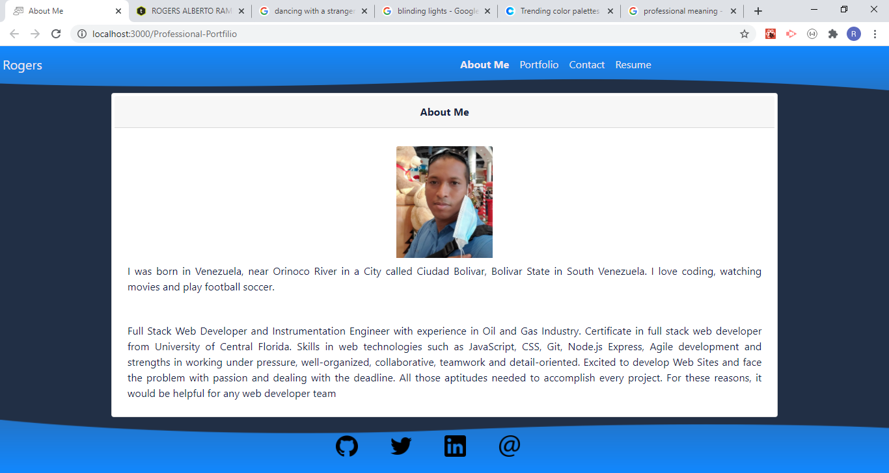
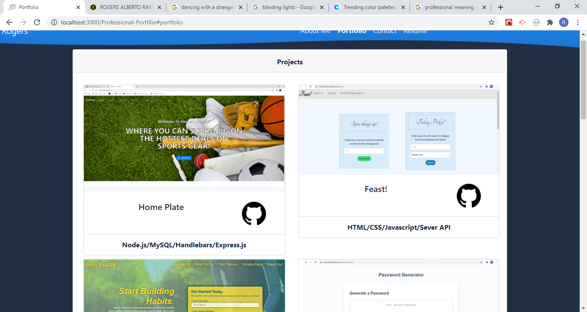
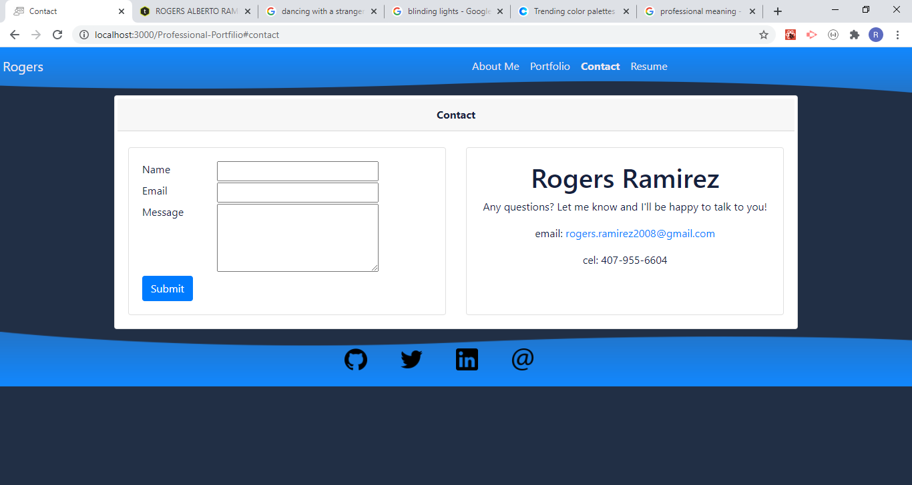
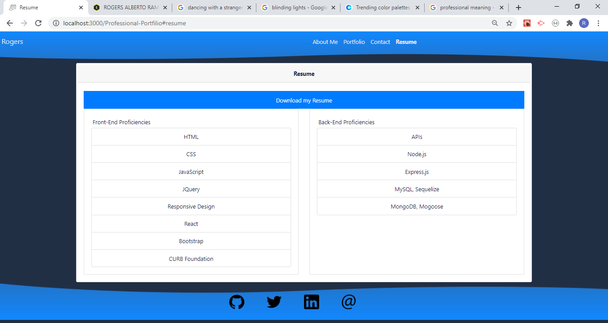
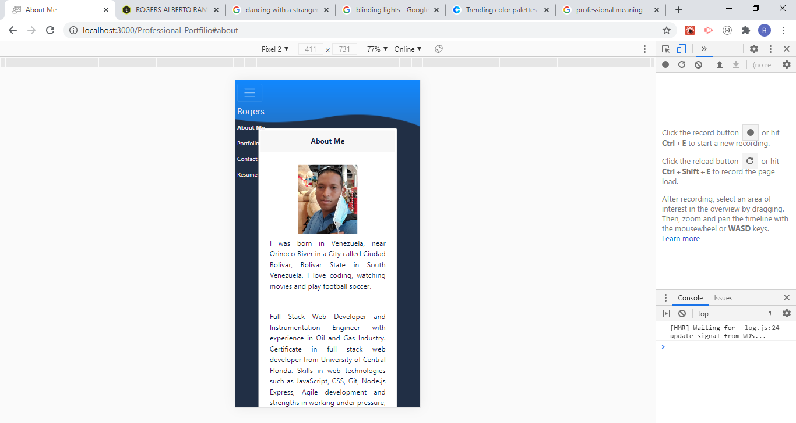
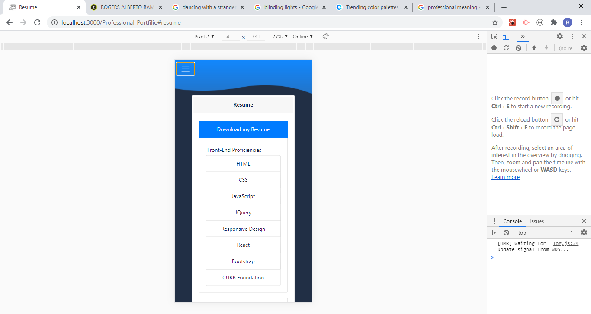

# Professional Portfolio with React

## Description 

Professional Portfolio developed in React as a front-end Framework. Wonderful to share skills and experiences through web.

You can take the app and make your own Professional Portfolio customized. 

## Table of Contents

* [URLs](#urls)
* [Installation](#installation)
* [Usage](#usage)
* [Contributing](#Contributing)
* [License](#license)
* [Test](#Test)
* [Questions](#questions)
* [Screenshots](#screenshots)

## URLs

* Deployed Application: 
    - [http://rogers0404.github.io/Professional-Portfolio](http://rogers0404.github.io/Professional-Portfolio) (live)

* GitHub Repository:
    - [HTTPS: https://github.com/rogers0404/Professional-Portfolio.git](https://github.com/rogers0404/Professional-Portfolio.git)
    - [GIT: git@github.com:rogers0404/Professional-Portfolio.git](git@github.com:rogers0404/Professional-Portfolio.git)

## Installation

You need some packages to run this application, 

- `git clone git@github.com:rogers0404/Professional-Porfilio.git        //clone the repository`
- `npx create-react-app professional-portfolio-v1       // or npx install to get all packages and dependencies of React`
- `npm install -D gh-pages                             //gh-pages as a devDependency`

## Usage 

Developing Component Funtions in React:

`import React from 'react';`
`import NavBar from '../NavBar';`
`function HeaderPage(props) {`
`  return (`
`    <header className="headerImage">`
`            <NavBar currentPage={props.currentPage} handlePageChange={props.handlePageChange} />`
`    </header>`
`  );`
`}`
`export default HeaderPage;`

The starting command-line is:

`npm run start                                 // to run the app`
`npm run deploy                                 // to deploy in Github`

## Contributing

* Rogers Ramirez, Github User: [rogers0404](http://github.com/rogers0404)

## License

Professional Porfolio with React is licensed under the

None

## Test

None

## Questions

If you have any questions about the application, you can check the documentation on my GitHub profile [https://github.com/rogers0404](https://github.com/rogers0404).

for more information you can have a question via email [rogers.ramirez2008@gmail.com](rogers.ramirez2008@gmail.com)  .

## Screenshots

### Screenshot 1

### Screenshot 2

### Screenshot 3

### Screenshot 4

### Screenshot 5

### Screenshot 6

### Video 1

[Video 1: YouTube](https://youtu.be/rJUqgRAPIac)

### Video 2

[Video 2: Google Drive](https://drive.google.com/file/d/1jPh6ioIH33oQQdOVNy_d3oNT7tdcM0u1/view)

